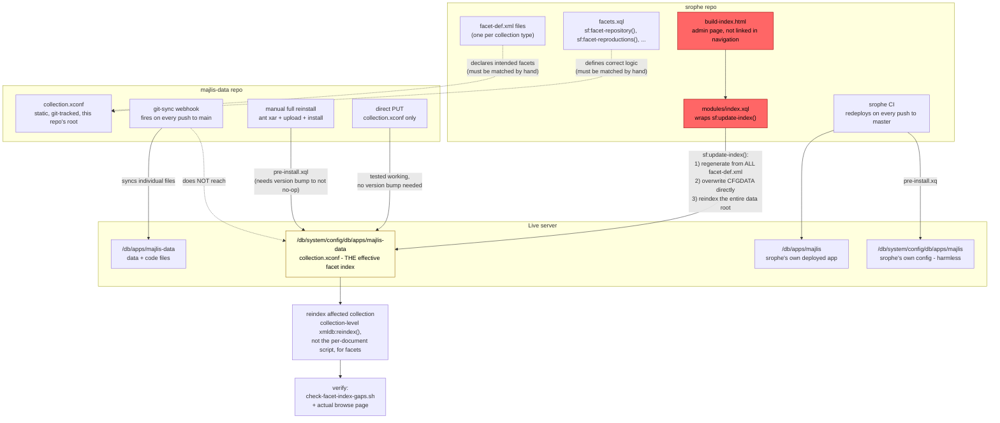
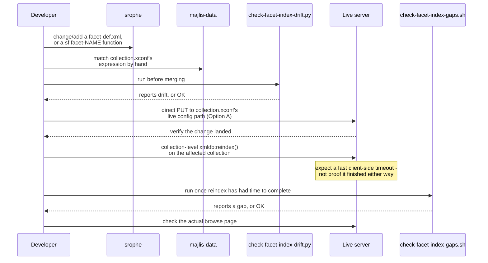

# Facet/index updates: how `srophe` and `majlis-data` relate

**Status as of 2026-09-09.** This document exists to have the full picture of how facet and
Lucene index updates actually work across both repos in one place, after several rounds of
questions during the 2026-09-08/09 facet-index investigation - see
`docs/git-sync-webhook-incidents.md` and `docs/facet-index-design-notes.md` for the incident
narrative this all traces back to, and `docs/runbook.md` for the step-by-step deploy
instructions this document explains the reasoning behind.

## Overview: how the two repos relate

**`srophe` defines what facets should exist and how they should be computed.** Each collection
type (`manuscripts`, `persons`, `places`, `works`, `bibl`, `geo`, ...) has its own
`facet-def.xml` in `srophe`, declaring the facets that collection is meant to have. For facets
needing special logic beyond a plain field lookup, `srophe`'s `facets.xql` has dedicated
functions like `sf:facet-repository()` and `sf:facet-reproductions()` defining exactly what
that logic is.

**`majlis-data` independently maintains a matching Lucene index config**
(`collection.xconf`, at this repo's root) that has to reflect those declarations by hand. This
is a departure from how `srophe`, as a shared framework, was originally designed to work (see
"Why `sf:update-index()` exists" below) - and it's the root of every bug found during this
investigation: `collection.xconf` fell out of sync with what `srophe` declares/computes, in two
different ways - `repository`/`reproductions` had stale, unwrapped expressions that didn't
match their `sf:facet-<name>()` logic, and `places`/`works`/`bibl`/`geo` have facets declared
in `srophe` with no corresponding entry in `majlis-data`'s config at all.

**`srophe` also contains a mechanism that would keep the two in sync automatically, if used**
- `sf:update-index()`. In the framework's original design, this is the intended fix for exactly
the drift described above. In this project specifically, it's dangerous instead, because it
would silently overwrite the separately-maintained file rather than something built to expect
that. Full detail in "The dangerous path" section below.

**`srophe`'s own routine development and deployment never touches `majlis-data`'s live config**
- confirmed via the two packages' different deploy targets (`/db/apps/majlis` vs.
`/db/apps/majlis-data`, and correspondingly different config paths under
`/db/system/config/...`). Writing and shipping ordinary `srophe` code carries none of the risk
described in this document on its own.

## Visual overview

How the pieces connect - which repo owns what, and which paths are safe vs. dangerous:

Red = the dangerous, cross-repo path. Yellow = the one live path everything else ultimately
targets. Dotted arrows = "must be kept in sync by a human," not an automatic connection.

The same information as a step-by-step sequence, for the *recommended* path when fixing or
adding a facet:

## The safe paths: how `collection.xconf` normally gets updated

Full step-by-step commands: `docs/runbook.md` section 4 ("Which deploy path does a given
change actually need?"). Summary:

- **Direct store / `PUT`** to `/db/system/config/db/apps/majlis-data/collection.xconf` -
  version-independent, tested working for both the `repository` and `reproductions` fixes.
  Sufficient for any `collection.xconf`-only change.
- **Full package reinstall** (`majlis-data`'s own `pre-install.xql`) - needed only for changes
  that require install-time logic to actually run (`pre-install.xql`/`post-install.xql` logic
  changes, `expath-pkg.xml` changes) - see `docs/package-version-bump.md`.
- **The git-sync webhook** keeps ordinary data/code files in sync automatically on every push
  to `main`, but does not reach `collection.xconf`'s live, effective path at all.

Either safe path still requires a manual reindex afterward - config changes never
retroactively apply to already-indexed documents (`docs/runbook.md` section 5).

## The dangerous path: `sf:update-index()`

**Not called deliberately in this project's current workflow, and recommended never to be.**

### What it is

`sf:update-index()` and its helper `sf:build-index()` live in `srophe`'s
`src/main/xar-resources/modules/lib/facets.xql` (lines 53 and 177). Together they regenerate
`collection.xconf` - the live Lucene index configuration - directly from whatever
`facet-def.xml` files are currently deployed, and then reindex.

### Why this mechanism exists at all - the idea behind it

`srophe` is not code written specifically for this project - it's a shared, reusable
application framework used across multiple "Syriaca.org family" projects. Two pieces of
concrete evidence for this, found during this investigation: `majlis-data`'s own
`expath-pkg.xml` was literally forked from an earlier package named `"caesarea-data"` (visible
in its git history), and the root-level `facet-def.xml` file still shipped in `srophe` has
comments like "A simple facet for browsing by Syriaca.org series" - a generic example, not
anything specific to this project's manuscripts or persons.

Given that, the design intent behind `sf:update-index()` makes sense: rather than every project
that reuses `srophe` having to hand-write and separately maintain its own Lucene index
configuration in parallel with its `facet-def.xml` declarations - exactly the kind of
error-prone, manually-synced-by-a-human setup that caused both the `repository` and
`reproductions` bugs this investigation found - the framework's intended architecture is for
`facet-def.xml` to be the single source of truth, with `collection.xconf` *automatically
derived* from it whenever `sf:update-index()` runs. In that intended architecture, there would
be no drift to catch, because nothing would be hand-maintained separately in the first place.

**Why it's dangerous here specifically, despite that reasonable intent**: this project departed
from that architecture. `majlis-data` maintains its own separate, static, git-committed
`collection.xconf` (the file this whole investigation has been fixing), rather than relying on
`srophe` to generate it dynamically. That departure was itself a response to `sf:update-index()`
overwriting things unexpectedly during the 2026-09-02/03 incident - but the practical effect is
that this project now has **two** systems that can each write the same live path, with nothing
coordinating them (see `facet-index-design-notes.md`'s "Possible improvements" for the
previously-proposed structural fixes to this - none implemented). The danger isn't that the
mechanism is badly designed for its original purpose; it's that this project no longer uses it
as intended, and nothing stops it from still firing.

### When it happens

- **Not as part of an ordinary `srophe` commit/deploy - confirmed, not assumed.** `post-install.xq`'s
  call to it is commented out (`(: sf:update-index(),:)`) - deliberately disabled. Separately,
  `srophe`'s own `pre-install.xq` (which does run on every deploy) only ever writes `.xconf`
  files to `/db/system/config/db/apps/majlis` - confirmed via its generated `repo.xml`,
  `<target>majlis</target>` - a different path entirely from
  `/db/system/config/db/apps/majlis-data`, which is what actually controls manuscript facets.
  So a routine `srophe` commit, merged and deployed through its normal CI pipeline (which
  redeploys on every push to `master`), structurally cannot reach `majlis-data`'s
  `collection.xconf` through either of `srophe`'s own install-time scripts. The facet-index
  bugs this investigation found would not recur through ordinary `srophe` development activity
  alone.
- **Via a live endpoint**: `modules/index.xql` wraps it - loading that page runs it. **Confirmed
  live on the server 2026-09-09**, via `sm:get-permissions()` (a safe, read-only check - never
  by actually requesting the URL, which would risk triggering the exact sequence being checked
  for): `mode="rwsr-xr-x"`, `acl entries="0"`. The last three characters (`r-x`) are the
  "other"/public permission bits, and the empty ACL means nothing else restricts it further -
  eXist's own permission layer places **no restriction at all** on unauthenticated execution of
  this file. The only thing that could still be protecting it is an outer layer (nginx, in
  front of this staging server) - unconfirmed, needs checking directly against that
  configuration, which this investigation does not have access to.
- **Via the intentional admin UI this endpoint exists for**: `build-index.html` (found
  2026-09-09) - a real page titled "Build Collection Indexes," not linked from any navigation
  or template (only `facets.xql` itself references it), with a button that fires an AJAX
  request to `modules/index.xql`. Its own description: *"On initiating an application or
  making changes to fields/facets in the facet-config.xml files the collection indexes will
  need to be rebuilt... You will need administrative permissions to run this script."* This is
  the most plausible real-world trigger: someone dealing with exactly the kind of facet problem
  this investigation fixed, reading that description, would reasonably conclude this is the
  correct fix and click it - not realizing it overwrites `majlis-data`'s separately-maintained
  static config rather than safely refreshing it. Not being linked in navigation is not real
  protection if `srophe`'s source is public - anyone who reads `facets.xql` or
  `build-index.html` learns both URLs exist regardless of whether the live site links to them.
  Someone who has correctly used this same page on a *different* project sharing this framework
  (one without `majlis-data`'s departure from the intended single-source-of-truth architecture)
  could also bring that habit here without realizing it doesn't apply.
- **Manually**, by someone directly invoking `sf:update-index()` via eXide or a REST query -
  apparently what happened once already, causing the 2026-09-02/03 incident.

### How it happens (the mechanism itself)

1. `sf:build-index()` walks every `facet-def.xml` currently deployed in `srophe`'s app
   collection and generates a fresh `collection.xconf` document from them.
2. That generated document is `xmldb:store()`d directly to
   `/db/system/config/db/apps/majlis-data/collection.xconf` - the live, effective config path -
   unconditionally overwriting whatever is already there. No diff, no confirmation step.
3. If the store succeeded, `xmldb:reindex($config:data-root)` runs immediately - a reindex of
   the *entire data root*, not one collection. Broader than anything done deliberately during
   this investigation (always scoped to `manuscripts`), and with none of the "confirm it
   actually finished" caution documented in `docs/runbook.md` section 5 after the incomplete
   reindex found on 2026-09-08.

**This document does not verify reachability of `modules/index.xql` by actually requesting it.**
Doing so would risk triggering the exact sequence above - checking would be indistinguishable
from causing the problem. Verification happened instead through inspecting server permissions
directly (`sm:get-permissions()`, a safe, read-only check - see "When it happens" above),
which confirmed eXist's own permission layer places no restriction on it. Whether an outer
layer (nginx) additionally restricts it is still unconfirmed and needs checking against that
configuration directly.

### How often it happens

Confirmed to have fired **at least once**: the 2026-09-02/03 incident, whose root cause was
traced specifically to this function overwriting a working `collection.xconf`. Beyond that
single confirmed occurrence, frequency is genuinely unknown - there is no server-side access
log available to this investigation to check how often `modules/index.xql` has been requested,
whether by a person, a script, or an automated crawler/scanner incidentally hitting a
discoverable URL. If the endpoint is in fact publicly reachable (unconfirmed - see above), any
number of additional silent firings is possible without anyone noticing until a symptom like
the 2026-09-08 facet duplication (documented above) surfaces again.

### Risks (summary)

- Silently replaces `majlis-data`'s git-tracked `collection.xconf` with a freshly-generated one,
  no review step. (The generated version does cover every collection's `facet-def.xml`, not
  just manuscripts, unlike the current static file - incidental, not the point.)
- Triggers an unscoped, full-data-root reindex synchronously, with the same
  completion-uncertainty documented in `docs/runbook.md` section 5, except across every
  collection at once rather than one at a time.
- If genuinely public, no confirmation gate exists at all between a single request and this
  entire sequence.

### Ways to reduce the risk - not yet done, each is a real code/access change, not isolated

- **Restrict `modules/index.xql`'s execute permission so "other" cannot run it.** Confirmed
  2026-09-09 that this is currently not the case at the eXist level (`mode="rwsr-xr-x"`, empty
  ACL) - only an unconfirmed outer (nginx) layer might currently be preventing public access.

  **How to actually do this, once decided:** the permission must be changed in `srophe`'s
  source, not just live on the server. `post-install.xq` re-applies
  `sm:chmod(xs:anyURI($target || '/modules/index.xql'), "rwsr-xr-x")` on *every* `srophe`
  deploy - a live-only permission change would silently get reset back to public-executable the
  next time `srophe`'s CI redeploys (it runs on every push to `master`). The fix:

  1. In `srophe`'s `src/main/xar-resources/post-install.xq`, change the mode string from
     `"rwsr-xr-x"` to something that removes "other" access while preserving legitimate use -
     e.g. `"rwsr-x---"` (owner keeps setuid-execute for the app's own internal use; the `dba`
     group - the file's current group owner - keeps read+execute, so anyone authenticated as an
     administrator can still use `build-index.html`'s "Build Collection Indexes" button;
     unauthenticated "other" loses execute entirely).
  2. Commit and deploy that change through `srophe`'s normal CI (merge to `master`) - this
     makes the fix durable, since the next deploy will re-apply the *new*, restricted mode
     instead of reverting it.
  3. To apply the same restriction immediately, without waiting for a deploy, the equivalent
     live change is a direct `sm:chmod()` call via an authenticated query
     (`sm:chmod(xs:anyURI('/db/apps/majlis/modules/index.xql'), "rwsr-x---")`) - but this alone
     is temporary and must still be paired with the source change in step 1, or it reverts on
     the next ordinary deploy.

  **Why this is expected to be reliable (reasoned through 2026-09-09, not yet applied):**
  scoped to exactly one permission bit on one file - owner (`majlis`, `rws`) and group (`dba`,
  `r-x`) stay unchanged, only "other" (anonymous) loses access, so anyone authenticated as the
  `dba` group or the `majlis` owner keeps working exactly as before, unaffected. It doesn't
  touch `git-sync.xql` or `sparql/update-rdf.xql`'s separate `chmod` calls in the same file,
  both of which legitimately need to stay public (`git-sync.xql` in particular, reachable by
  GitHub's webhook, an external unauthenticated caller). `build-index.html` is the only known
  caller of this URL anywhere in `srophe`'s codebase (confirmed by search) - its own text
  already claims *"You will need administrative permissions to run this script,"* so this
  change makes that existing claim actually enforced rather than adding a new, unexpected
  restriction. It ships through `srophe`'s routine CI, already confirmed structurally unable to
  touch `majlis-data`'s facet config, so it's unrelated to anything else in this investigation.

  **What isn't fully verified, disclosed rather than assumed away**: this relies on standard
  eXist-db security-manager behavior - an unauthenticated request resolves to a "guest" user not
  belonging to `dba`, falling through to the "other" bits and being denied. That's the normal,
  expected behavior, but it has not been verified against this specific server's exact
  configuration, and testing it live would risk the exact problem being fixed. Similarly, "no
  other caller" is confirmed only within `srophe`'s own repository, searched directly - an
  external script, monitoring tool, or reference elsewhere depending on unauthenticated access
  to this URL cannot be fully ruled out, though nothing found during this investigation suggests
  one exists.
- Turn `sf:build-index()`/`sf:update-index()` into a diff/validator that reports what *would*
  change instead of silently applying it (already proposed in `facet-index-design-notes.md`).
- Decouple "store the generated config" from "reindex everything" so triggering one doesn't
  automatically cascade into the other.
- Confirm, through inspecting the nginx configuration directly rather than a live request,
  whether it additionally restricts this URL - this determines how urgent the rest of this list
  actually is, now that eXist's own layer is confirmed not to. See to-do item 1 above for the
  access note (this needs separate SSH/OS-level access, not the eXist REST credentials used
  elsewhere in this document) and the exact command.

## To-do (identified 2026-09-09, not yet done)

Prioritized order - each depends somewhat on the one before it:

1. **Confirm whether an outer layer (nginx) restricts `modules/index.xql`.** Partially resolved
   2026-09-09: eXist's own permission layer confirmed to place no restriction on it
   (`sm:get-permissions()`, `mode="rwsr-xr-x"`, empty ACL - see "When it happens" above). The
   only remaining unknown is whether nginx, in front of this staging server, independently
   blocks or authenticates this specific URL before eXist ever sees the request. This needs
   checking directly against the nginx configuration, not a live HTTP request to the endpoint
   itself (which would risk triggering the exact sequence being checked for).

   **Access note (confirmed 2026-09-09): the person doing this work has only the eXist REST
   API credentials** (`REMOTE_EDB_SERVER_URL` / `REMOTE_EDB_SERVER_USERNAME` /
   `REMOTE_EDB_SERVER_PASSWORD`, used for every other query in this document and
   `docs/runbook.md`) - **not** SSH/OS-level access to the staging server itself. Those eXist
   credentials are an application-level credential over HTTPS; they authenticate against
   eXist, not the operating system, and do not grant the ability to read files like nginx's
   configuration. This step is therefore currently blocked and needs either a different
   person with that access, or a separate access request - it is not something the person who
   did the rest of this investigation can complete alone. The check itself, once that access
   exists: SSH into the server, then `sudo nginx -T | grep -B3 -A60 "server_name
   manuforma-staging.jalit.org"`, looking for a `location` block matching
   `/exist/apps/majlis/modules/` (or a broader `.xql$`/`/exist/` pattern) and whether it
   carries `auth_basic`, `allow`/`deny`, or `satisfy` directives.
2. **Decide on the 9 missing facets** (`places`/`type`, `works`/`subjects`,`author`,
   `publicationDate`, `bibl`/`subjects`,`author`,`publicationDate`, `geo`/`type`,`bibl` -
   currently listed in `KNOWN_ACCEPTED_GAPS` in `scripts/check-facet-index-drift.py`). Real,
   user-visible gap, deliberately not fixed alongside the `repository`/`reproductions` work
   because it's comparable in scope across four collections rather than one facet in one.
   **Explicitly deprioritized 2026-09-09** ("Forget about 9 missing facets at the moment") -
   not forgotten, a deliberate choice to set aside for now. Worth scheduling as its own
   deliberate piece of work when picked back up, not folded into something else.
3. **Restrict `modules/index.xql`'s execute permission.** The fix itself is fully specified and
   ready to apply regardless of what #1 finds - see "Ways to reduce the risk" above, under "How
   to actually do this" and "Why this is expected to be reliable," both written 2026-09-09.
   **Explicitly deferred 2026-09-09** ("leave it now") - a deliberate pause on implementation,
   not a gap in the reasoning or instructions. What #1 (the nginx check) actually determines is
   how *urgent* this is, not whether it's ready to do - it's ready now.
4. **Turn `sf:build-index()`/`sf:update-index()` into a diff/validator** that reports what
   *would* change instead of silently applying it, rather than leaving the dangerous version as
   the only one that exists. A real `srophe` code change - not isolated, touches shared
   framework code other projects also use.
5. **Build the actual CI pipeline for `majlis-data`** (`~/Desktop/ci-automation-design.md` -
   still just a draft, nothing implemented). This is the umbrella item items 6 and 7 below hang
   off of - neither can be automated without it existing first.
6. **Wire `scripts/check-facet-index-drift.py` into that pipeline** as an automated gate that
   fails a merge on drift, once #5 exists - already noted as a proposed step in
   `~/Desktop/ci-automation-design.md`'s "Worth adding once this pipeline exists" section.
7. **Build a post-deploy smoke test** - proposed in `facet-index-design-notes.md`'s "Possible
   improvements" list, not built. Would check that a browse page returns non-empty results and
   correct-looking facet counts right after every deploy, rather than relying on someone
   noticing a suspicious number by hand - which is exactly how the incomplete-reindex gap
   during the `reproductions` deploy was actually found (`docs/runbook.md` section 5). Depends
   on #5 existing to run automatically; `scripts/check-facet-index-gaps.sh`
   (`scripts/check-facet-index-gaps.md` for full usage) could be the core of what this check
   runs, once it has somewhere automated to run in.

## Resuming this work

Start by re-reading this file, then `facets.xql` (`sf:build-index()`, `sf:update-index()`,
lines 53-187), `post-install.xq`, and `modules/index.xql`, all in `srophe`. To-do item 1 (the
nginx check) is confirmed blocked as of 2026-09-09 pending someone with SSH/OS-level server
access - don't lead with it as the next action unless that access has since become available.
Item 3 (the permission fix) is fully specified and ready to apply without waiting on item 1;
item 4 (turning `sf:update-index()` into a validator) needs no server access at all, only
`srophe` development work. Either is a more realistic starting point than item 1 if resuming
without new access.
